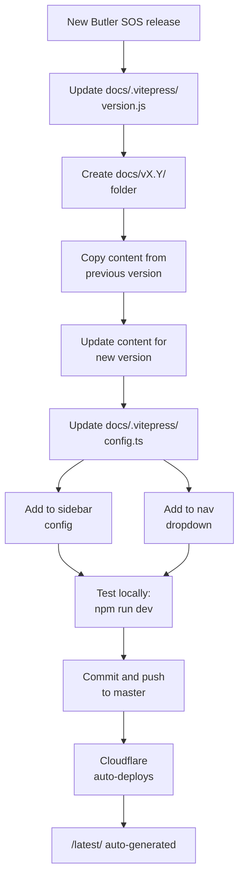

# Butler SOS Documentation Site

This repository contains the [VitePress](https://vitepress.dev/)-based documentation for [Butler SOS](https://github.com/ptarmiganlabs/butler-sos), an open source monitoring tool for [Qlik Sense](https://www.qlik.com/us/products/qlik-sense).

**Live site**: [butler-sos.ptarmiganlabs.com](https://butler-sos.ptarmiganlabs.com)  
**Hosting**: Cloudflare Pages with automatic deployment on commits to `master` branch

## Quick Start

### Prerequisites

- Node.js 18+ and npm

### Commands

```bash
npm install          # Install dependencies
npm run dev          # Start dev server (http://localhost:5173)
npm run build        # Build production site
npm run serve        # Preview production build
```

All commands run pre-scripts automatically (version fetching + `/latest/` generation).

## Repository Structure

```
butler-sos-docs/
├── docs/
│   ├── v14.0/           # Version 14.0 docs (source - edit here)
│   ├── v15.0/           # Version 15.0 docs (source - edit here)
│   ├── latest/          # Auto-generated from latest version (DO NOT EDIT)
│   ├── .vitepress/      # VitePress configuration
│   │   ├── config.ts    # Site config (nav, sidebar, theme)
│   │   └── version.js   # Auto-generated version info
│   ├── public/          # Static assets (images, favicons, etc.)
│   └── index.md         # Homepage
├── scripts/
│   ├── fetch-butler-sos-version.mjs  # Fetches latest Butler SOS version
│   └── copy-latest-docs.mjs          # Generates /latest/ folder
└── package.json
```

## Version Management System

The documentation uses a versioned folder structure with automatic generation of a "latest" version:

**Source folders** (`v14.0/`, `v15.0/`): Manually maintained documentation for each major version.

**Generated folder** (`latest/`): Automatically created from the latest version folder at build time. This folder should never be edited directly.

**Version tracking** (`version.js`): Automatically fetched from the GitHub releases API to determine which version is "latest".

### Automated Scripts

Two scripts run automatically before every `dev`, `build`, and `serve` command:

1. **`fetch-butler-sos-version.mjs`**: Queries the GitHub releases API to get the latest Butler SOS version and writes it to `docs/.vitepress/version.js`.

2. **`copy-latest-docs.mjs`**: Reads the version from `version.js`, copies the corresponding version folder (e.g., `v15.0/`) to `latest/`, and rewrites all internal links from version-specific paths to `/latest/` paths.

## Adding a New Version

When Butler SOS releases a new major version (e.g., v16.0), follow this workflow:



### Step-by-Step Checklist

1. **Update version**: Edit `docs/.vitepress/version.js` with the new version (e.g., `export const version = 'v16.0.0';`)

2. **Create version folder**: 
   ```bash
   mkdir -p docs/v16.0
   cp -r docs/v15.0/* docs/v16.0/
   ```

3. **Update content**: Modify documentation in `docs/v16.0/` as needed for the new version

4. **Update configuration**: Edit `docs/.vitepress/config.ts`:
   - Add sidebar entry: `'/v16.0/': createSidebar('/v16.0'),`
   - Add nav dropdown item: `{ text: 'v16.0', link: '/v16.0/about/' }`

5. **Test locally**: Run `npm run dev` and verify the new version appears in the nav and sidebar

6. **Deploy**: Commit and push to `master` - Cloudflare Pages will auto-deploy

## Key Conventions

### Sidebar Configuration

The sidebar is defined once via the `createSidebar(prefix)` function in `config.ts`. All versions use the same structure with different path prefixes:

```typescript
sidebar: {
  '/v14.0/': createSidebar('/v14.0'),
  '/v15.0/': createSidebar('/v15.0'),
  '/latest/': createSidebar('/latest'),
}
```

Never duplicate sidebar definitions - just add a new line with the appropriate prefix.

### Images

Use the `<ResponsiveImage>` component for images with captions and zoom functionality:

```markdown
<ResponsiveImage 
  src="./image.png" 
  alt="Description" 
  caption="Caption text" 
  maxWidth="450px" 
/>
```

Store images in `docs/public/` or relative to the markdown file.

### Links

- **In source docs** (`v14.0/`, `v15.0/`): Use version-specific paths like `/v15.0/about/`
- **Generated `/latest/`**: Links are automatically rewritten from version-specific to `/latest/` paths
- **Homepage and nav**: The "Guide" link and homepage "Learn More" button point to `/latest/about/`

## Build and Deployment

### Build Process

1. **Pre-scripts run automatically**:
   - Fetch latest version from GitHub releases API
   - Generate `/latest/` folder from the latest version

2. **VitePress builds** the site to `docs/.vitepress/dist/`

3. **Output** is optimized for production with minification and tree-shaking

### Deployment

- **Trigger**: Commits to the `master` branch
- **Platform**: Cloudflare Pages
- **Process**: Fully automatic - no manual deployment needed
- **URL**: https://butler-sos.ptarmiganlabs.com

## Additional Resources

For more detailed information, see:

- **`AGENTS.md`** - AI agent instructions for working with this repository
- **`CLAUDE.md`** - Claude-specific instructions (identical to AGENTS.md)
- **`.github/copilot-instructions.md`** - Comprehensive guide for GitHub Copilot
