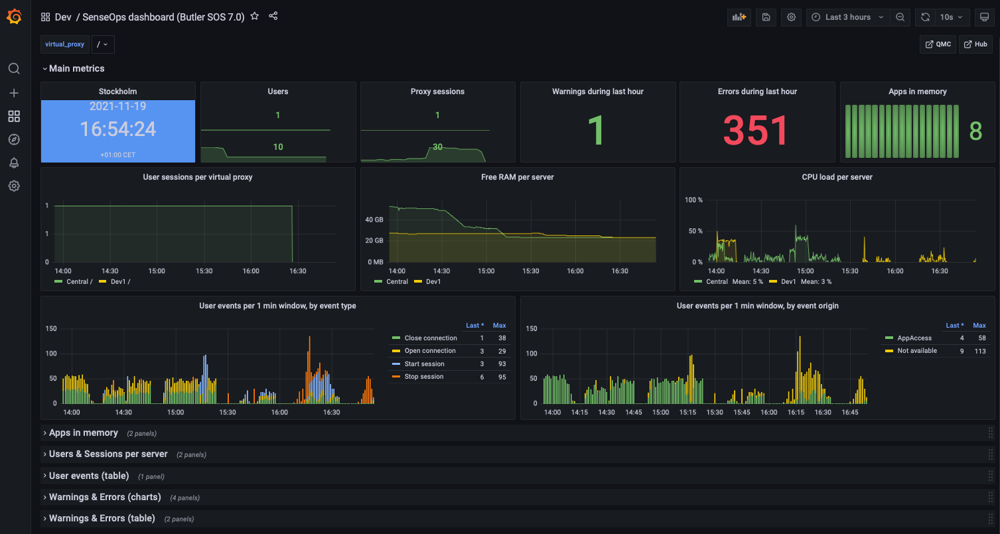


The screen shots below are taken from the Grafana 8 demo dashboard that's [included in the Butler SOS repository](https://github.com/ptarmiganlabs/butler-sos/blob/master/docs/grafana/senseops_v7_0_dashboard.json).

Feel free to modify it to your specific needs.


A concept that has proven useful many times is to use an overview dashboard to monitors high-level metrics for the entire Sense cluster. A separate, parameterised dashboard then drill into the details for each server.  
Grafana variables make this both easy to set up, scalable and very powerful.

Sample dashboards are available in the [Git repository](https://github.com/ptarmiganlabs/butler-sos/tree/master/docs/grafana).  
Before importing these to Grafana you should create a Grafana data source called "senseops", and point it to your InfluxDB database. When you then import the dashboards they should find your database straight away.

## Dashboard installation

The dashboard file `senseops_v7_0_dashboard.json` was created using Butler SOS 7.0 and Grafana 8. It thus usees the new chart, data transformation and alerting features that were introduced in Grafana 8.

## Overview metrics

The dashboard has a top section that's always expanded.  
A set of (by default) collapsed sections contain different kinds of metrics and log events.

*Top level metrics*

Low memory alerts can be set (using Grafana's alert feature). Such alerts can be sent (using features built into Grafana) as notifications to Slack, Teams, Pager Duty, as email etc.
To keep the dashboard nice and clean it's usually a good idea to put alert charts in their own section at the bottom, or in a separate dashboard dedicated to alerts.

## Apps in memory

From a sysadmin perspective it's often interesting to know what apps are loaded into memory on each Sense server.  
For example, when a server is quickly loosing RAM it's extremely useful to be able to zoom in to the very minute when the RAM drop occurs, then look at what apps were present in memory. One of those apps is probably not well designed, or is at least using a lot of memory.

The dashboard separates regular apps and session apps.  
You can also use Grafana's standard filtering features to narrow down on the server(s) of interest.

*Apps loaded into memory*

## Users & sessions per server

If things really go wrong wrong in a Qlik Sense Enterprise environment there connected users might be kicked out. It is therefore important to know at any given time how many users are connected, and be able to detect sudden drops in user count.

Another use case could be for maintenance windows: You then want to know how many - and which - users are connected, so you can send them a message that maintenance is about to start.

*Users and sessions per server*

## User events

If Butler SOS has been configured to handle user level events coming from Sense, these are shown here.

You get information about where the event took place and which user has

- logged in (started a session)
- logged out (stopped a session)
- timed out (stopped a session)
- opened a connection to a new app
- closed a connection to an app (for example closed a browser tab)
- ... and more

*User events*

## Warnings & Errors

In previous Butler SOS demo dashboards this information came from log db.  
Starting with Butler SOS 7 the source of this data is instead the log events introduced in version 7.

Some of this information is also available in the standard Operations Monitor app in Qlik Sense Enterprise, but only in a retrospective way.  
Having access to it in close to real time makes it possible to act on developing issues quicker.

Charts provide overview while tables then give the actual messages, as they appear in the log files.

*Error and warning charts*

*Error and warning tables*

It's also possible to drill down into individual warnings and errors to get very detailed information about what happened:

*Detailed view into errors and warnings*

## Butler SOS metrics

Butler SOS is very robust indeed, but it may still be of interest to track its memory use, to make sure there aren't any memory leaks etc.

*Butler SOS memory usage*
