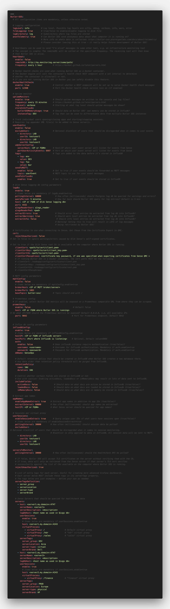

{}
Either JSON or YAML notation can be used to create the configuration file, with file extensions of .json and .yaml/.yml, respectively.

YAML is strongly recommended, as it is easier to edit/read/understand compared to JSON.
{}

The parameters in the config file are described below.
All parameters must be defined in the config file - run time errors are likely to occur otherwise.
The [sample config file](https://github.com/ptarmiganlabs/butler-sos/blob/master/src/config/production_template.yaml) looks like this:



<br>

A few things to keep in mind:

- Topic names (e.g. "Butler-SOS.logdb") are case sensitive.
- First time Butler SOS is started, a new InfluxDB database will be created, together with a default InfluxDB retention policy.

<br>

| Parameter | Description |
| --------- | ----------- |
|  |  |
| logLevel | The level of details in the logs. Possible values are silly, debug, verbose, info, warn, error (in order of decreasing level of detail). |
| fileLogging | true/false to enable/disable logging to disk file |
| logDirectory | Subdirectory where log files are stored |
| anonTelemetry | Can Butler SOS send anonymous data about what computer it is running on? More info on whata data is collected [here](https://butler-sos.ptarmiganlabs.com/docs/about/telemetry). |
|  |  |
| **Butler-SOS.heartbeat** |  |
| enable  | Should heartbeats be sent to some URL, indicating that Butler SOS is alive and well? true/false |
| remoteURL | URL that will be called for heartbeats |
| frequency | How often should heartbeats be sent? Format according to https://bunkat.github.io/later/parsers.html |
|  |  |
| **Butler-SOS.dockerHealthCheck** |  |
| enable | Should a Docker healthcheck endpoint be created within Butler SOS? Set to false if *not* running Butler SOS under Docker. true/false |
| port | Port the healthcheck should use. Usually 12398, but might need be changed if seveal Butler instances run on the same server |
|  |  |
| **Butler-SOS.uptimeMonitor** |  |
| enable  | Should messages with Butler SOS uptime and memory usage be written to console and logs? true/false |
| frequency | How often should uptime messages be written to console and/or logs? Format according to https://bunkat.github.io/later/parsers.html |
| logLevel | Starting at what log level should uptime messages be used? Possible values are silly, debug, verbose, info, warn, error. For example, if you specify "verbose" here, uptime messages will appear if you set overall log level to silly, debug or verbose. |
| storeInInfluxdb.<br>butlerSOSMemoryUsage | Should data on Butler SOS' own memory use be stored in Infludb? true/false |
| storeInInfluxdb.<br>instanceTag | Tag used to differentiate data from multiple Butler SOS instances. Useful if running different Butler SOS instances against (for example) DEV, TEST and PROD environments |
|  |  |
| **Butler-SOS.userEvents** |  |
| enable | Shouls Butler SOS track detailed user events (i.e. session start/stop, connection open/close)? true/false |
| excludeUser | Array of users (=directory/userId pairs) that should be disregarded when user events arrive from Sense. |
| udpServerConfig.<br>serverHost | IP/host where Butler SOS is running and the user event UDP server will run. |
| udpServerConfig.<br>portUserActivityEvents | Port on which the user event UDP server will listen. |
| tags | Array of tags (tagName/tagValue pairs) that should be added to each user event before sending it to InfluxDB. |
| sendToMQTT.enable | Should user events be sent to MQTT? true/false |
| sendToMQTT.topic | MQTT topic which user event data will be posted to. |
| sendToInfluxdb.enable | Should user events be saved in InfluxDB? true/false |
|  |  |
| **Butler-SOS.logdb** |  |
| enable | Should Sense log db be queried for warnings/errors/info messages? true/false |
| pollingInterval | How often to query log db. Milliseconds |
| queryPeriod | How far back should log db be queried? Human readable, e.g. "5 minutes" (which is also the default value)|
| host | IP or FQDN of server where Sense log db is running |
| port | Port used by log db. 4432 unless changed during installation of Sense |
| qlogsReaderUser | User to connect to log db as. "qlogs_reader" unless changed during installation of Sense |
| qlogsReaderPwd | Password of above user |
| extractErrors | Should error entries be extracted from log db? true/false |
| extractWarnings | Should warning entries be extracted from log db? true/false |
| extractInfo | Should info entries be extracted from log db? true/false. <br>**NOTE:** If info level logging is enabled, this will result in lots of messages being stored in Influxdb (at least for a busy Sense cluster).  |
|  |  |
| **Butler-SOS.cert** |  |
| clientCert | Certificate file. Exported from QMC |
| clientCertKey | Certificate key file. Exported from QMC |
| clientCertCA | Root certificate for above certificate files. Exported from QMC |
| clientCertPassphrase | Password used to protect the certificate (as set when exporting cert from QMC) |
|  |  |
| **Butler-SOS.mqttConfig** |  |
| enable | Should health metrics be sent to MQTT? true/false |
| brokerHost | IP or FQDN of MQTT broker |
| brokerPort | Broker port |
| baseTopic | The topic to which messages will be posted. Should end with /. For example butler-sos/ |
|  |  |
| **Butler-SOS.influxdbConfig** |  |
| enable | Should health metrics be stored in Influxdb? true/false |
| hostIP | IP or FQDN of Influxdb server |
| hostPort | Port where Influxdb server is listening. Useful if Influxdb for some reason is not using its standard port of 8086 |
| auth.enable | Enable if data is to be stored in a password protected Influxdb database |
| auth.username | Influxdb username |
| auth.password | Influxdb password |
| dbName | Database namne in Influxdb to which health metrics will be stored. Database will be created if it does not already exist when Butler SOS is started |
| retentionPolicy.<br>name | Name of default retention policy that will be created in InfluxDB database, when that database is created during first execution of Butler SOS |
| retentionPolicy.<br>duration | Duration during which metrics are kept in InfluxDB. After the duration has passed, InfluxDB will purge all data older than duration from the database. See [InfluxDB docs](https://docs.influxdata.com/influxdb/v1.7/query_language/database_management/#retention-policy-management) for details on syntax. |
| includeFields.<br>activeDocs | Should a list of currently active Sense apps be stored in Influxdb? true/false |
| includeFields.<br>loadedDocs | Should a list of Sense apps opened in a user session be stored in Influxdb? true/false |
| includeFields.<br>activeDocs | Should a list of Sense apps loaded into memory (some apps might not currently be associated with a user session) be stored in Influxdb? true/false |
|  |  |
| **Butler-SOS.userSessions** |  |
| enableSessionExtract | Influxdb password |
| pollingInterval | Influxdb password |
| excludeUser | Array of users (=directory/userId pairs) that should be disregarded when user session data arrives from Sense. |
|  |  |
| **Butler-SOS.serversToMonitor** |  |
| pollingInterval | How often to query the Sense healthcheck API |
| serverTagsDefinition | List of tags to add to each server when storing the data in Influxdb. All tags defined here MUST be present in each server's definition section further down in the config file! |
| servers | List of what servers to monitor. For each server a set of properties MUST be defined. |
| servers.<br>host:4747 | FQDN of server. Domain should match that of the certificate exported from QMC - otherwise certificate warnings may appear. NOTE: You need to specify the port too - should be :4747 unless it's been changed from default value (*very* unusual to change this). |
| servers.<br>serverName | Human friendly server name |
| servers.<br>serverDescription | Human friendly server description |
| servers.<br>logDbHost | Server's name as it appears in the ```process_host``` field log db. This is needed in order to link entries in logdb to the specific server at hand. See note below too! |
| servers.<br>userSessions.<br>enable | Control whether user session data should be retrieved for this server |
| servers.<br>userSessions.<br>host | Host and port from which to retrieve user session data. Usually on the form servername.mydomain.net:4243 |
| servers.<br>userSessions.<br>virtualProxies | A list of key-value pairs. Use to specify for which virtual proxies on this server user session data should be retrieved. |
| serverTags | A list of key-value pairs. Use to provide more metadata for servers. Can then (among other things) be used to created more advanced Grafana dashboards. |

The ```Butler-SOS.serversToMonitor.servers.logDbHost``` property can be tricky to get right. Easiest way to get the correct value is to look in the Nodes section in the QMC. In the ```Host name``` column you find the host names of the various nodes. ```logDbHost``` should be set to the first part of each host name:


