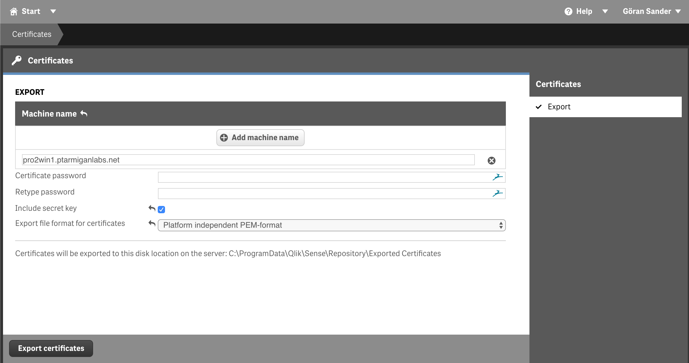

{}
These settings are mandatory.  
They must exist in the config file and be correctly set for Butler SOS to work.
{}

## What's this?

In order to interact with a Qlik Sense Enterprise on Windows (QSEoW) environment, Butler SOS needs to know a few things about that environment. This is true no matter if the Sense cluster consists of a single Sense server or many.

## Settings in main config file

```yaml
---
Butler-SOS:
  ...
  ...
  # Qlik Sense logging db config parameters
  logdb:
    enable: true
    # Items below are mandatory if logdb.enable=true
    pollingInterval: 60000            # How often (milliseconds) should Postgres log db be queried for warnings and errors?
    queryPeriod: 5 minutes            # How far back should Butler SOS query for log entries? Default is 5 min
    host: <IP or FQDN of Qlik Sense logging db>
    port: 4432
    qlogsReaderUser: qlogs_reader
    qlogsReaderPwd: <pwd>
    extractErrors: true               # Should error level entries be extracted from log db into Influxdb?
    extractWarnings: true             # Should warn level entries be extracted from log db into Influxdb?
    extractInfo: false                 # Should info level entries be extracted from log db into Influxdb? 
                                      # Warning! Seting this to true will result in LOTS of log messages 
                                      # being retrrieved by Butler SOS!

# Certificates to use when connecting to Sense. Get these from the Certificate Export in QMC.
  cert:
    clientCert: <path/to/cert/client.pem>
    clientCertKey: <path/to/cert/client_key.pem>
    clientCertCA: <path/to/cert/root.pem>
    clientCertPassphrase: <certificate key password, if one was specified when exporting certificates from Sense QMC >
    # If running Butler in a Docker container, the cert paths MUST be the following
    # clientCert: /nodeapp/config/certificate/client.pem
    # clientCertKey: /nodeapp/config/certificate/client_key.pem
    # clientCertCA: /nodeapp/config/certificate/root.pem
    # clientCertPassphrase: 
  ...
  ...
```

## Qlik Sense certificates

Butler SOS uses certificates to authenticate with Qlik Sense.  
These certificates must be exported from the Qlik Management Console (QMC).


To export certificates you need to provide a few pieces of information:  

1. Name of the server where the certificate will be used (i.e. where Butler SOS will be running).

2. Butler SOS can handle certificates with or without password protection. If you choose to use a password, you must enter that password in the Butler SOS config file.

3. Check the "Include secret key" check box.

4. Export certificates in PEM format.



Then click the "Export certificates" button. If all goes well the certificates are now exported to a folder on the Sense server to which you are connected (i.e. the server hosting the virtual proxy you are connected to):


The exported certificate files will be used when [configuring Butler SOS](/docs/getting_started/install_config/config_file_format/).
