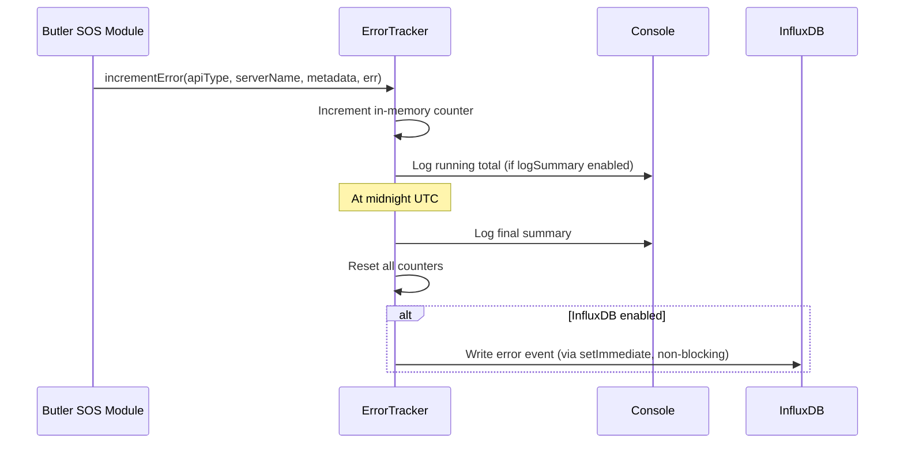

# Error Tracking

Butler SOS automatically monitors and records errors that occur when:

- Communicating with Qlik Sense servers (health checks, proxy sessions, app metadata)
- Writing metrics to destination systems (InfluxDB, MQTT, New Relic)
- Processing incoming UDP events from Qlik Sense

Error tracking helps you identify communication failures, misconfigurations, and connectivity issues across your Qlik Sense environment.

## Master Switch

`Butler-SOS.errorTracking.enable: false` disables **all** error tracking — in-memory counting, daily summary logging, and InfluxDB writes are all skipped. When set to `true` (the default), individual feature flags (`logSummary.enable`, `influxdb.enable`) control each sub-feature independently.

## How It Works



1. **Error detection**: When Butler SOS fails to communicate with a Qlik Sense server or write data to a destination system, the error is captured automatically.

2. **In-memory tracking**: Errors are counted and grouped by error type and server name. This running count is visible in the console logs.

3. **Daily summary**: At midnight UTC, Butler SOS logs a summary of all errors that occurred during the day and resets the counters (if `logSummary.enable` is true).

4. **InfluxDB write (optional)**: If `errorTracking.influxdb.enable` is true, each error is written as a separate data point in InfluxDB. Each point includes tags identifying the error type, server, host, virtual proxy, destination host, and module, plus an `error_category` field that categorizes the error (e.g., timeout, connection refused, auth error).

## Configuration

```yaml
Butler-SOS:
  errorTracking:
    enable: true                          # Master switch — disables all tracking when false
    logSummary:
      enable: true                        # Log daily error summary to console
    influxdb:
      enable: true                        # Write individual error events to InfluxDB
      measurementName: butler_sos_errors  # InfluxDB measurement name
```

| Parameter | Description |
|-----------|-------------|
| `enable` | Master switch for all error tracking. `true`/`false` |
| `logSummary.enable` | Log daily error summary to console. `true`/`false` |
| `influxdb.enable` | Write individual error events to InfluxDB. `true`/`false` |
| `influxdb.measurementName` | InfluxDB measurement name (default: `butler_sos_errors`) |

## Error Types

These error type codes appear as the `error_type` tag in InfluxDB and in console log messages.

| Error Type | Description |
|------------|-------------|
| `HEALTH_API` | Health check API failures |
| `PROXY_API` | Proxy session API failures |
| `APP_NAMES_EXTRACT` | App name extraction failures |
| `INFLUXDB_V1_WRITE` | InfluxDB v1 write failures |
| `INFLUXDB_V2_WRITE` | InfluxDB v2 write failures |
| `INFLUXDB_V3_WRITE` | InfluxDB v3 write failures |
| `MQTT_PUBLISH` | MQTT publish failures |
| `NEW_RELIC_POST` | New Relic API post failures |
| `UDP_USER_EVENT` | UDP user event processing failures |
| `UDP_LOG_EVENT` | UDP log event processing failures |

## Module Context Values

When viewing errors in InfluxDB or Grafana, the `module` tag identifies which part of Butler SOS generated the error. This helps you pinpoint which subsystem is experiencing issues.

| Module Value | Description |
|--------------|-------------|
| `HEALTH_METRICS` | Qlik Sense engine health data write |
| `PROXY_SESSIONS` | Qlik Sense proxy session data write |
| `LOG_EVENTS` | Log event data write |
| `USER_EVENTS` | User event data write |
| `EVENT_COUNTS` | Event count metrics write |
| `REJECTED_EVENT_COUNTS` | Rejected event count metrics write |
| `QUEUE_METRICS` | Queue metrics write |
| `BUTLER_MEMORY` | Butler SOS own memory usage write |
| `HEALTH_METRICS_MQTT` | MQTT publish for health metrics |
| `PROXY_SESSIONS_MQTT` | MQTT publish for proxy sessions |
| `USER_EVENTS_MQTT` | MQTT publish for user events |
| `LOG_EVENTS_MQTT` | MQTT publish for log events |
| `HEALTH_METRICS_NEW_RELIC` | New Relic post for health metrics |
| `PROXY_SESSIONS_NEW_RELIC` | New Relic post for proxy sessions |
| `UPTIME_NEW_RELIC` | New Relic post for Butler SOS uptime |
| `UDP_USER_EVENTS` | UDP handler for user events |
| `UDP_LOG_EVENTS` | UDP handler for log events |

## InfluxDB Data Model

Every error event written to InfluxDB produces one data point with a mix of **tags** (indexed, for filtering/grouping) and **fields** (values, for querying/alerting).

### Tags

| Tag | Always present | Value |
|-----|---------------|-------|
| `error_type` | Yes | One of the error type codes (e.g. `HEALTH_API`, `INFLUXDB_V3_WRITE`) |
| `server_name` | Yes | Configured Qlik Sense server name, or `''` if not applicable |
| `host` | When provided | Hostname/IP of the Qlik Sense server or MQTT broker |
| `virtual_proxy` | `PROXY_API`, `PROXY_SESSIONS_MQTT` only | Virtual proxy prefix (e.g. `/`, `/hdr`) |
| `destination_host` | Destination write errors | Target URL for InfluxDB, New Relic etc. |
| `module` | When provided | Butler SOS subsystem (see Module Context Values table) |

### Fields

| Field | Type | Always present | Description |
|-------|------|---------------|-------------|
| `error_count` | integer | Yes | Always `1` — one point per error event |
| `error_category` | string | Yes | Human-readable category (see Error Categorization below) |
| `error_code` | string | When present | OS/library error code (e.g. `ECONNREFUSED`, `ETIMEDOUT`) |
| `http_status` | integer | HTTP errors only | HTTP response status code (e.g. `401`, `503`) |
| `request_url` | string | Axios errors only | Sanitized request URL — scheme + host + path, **query string stripped** |
| `request_timeout_ms` | integer | Axios errors with timeout | Configured Axios timeout in milliseconds (e.g. `5000`) |
| `remote_address` | string | TCP connection errors | Remote IP that was dialled |
| `remote_port` | integer | TCP connection errors | Remote port that was dialled |
| `syscall` | string | TCP connection errors | OS syscall that failed (e.g. `connect`) |

> `request_url` has query parameters stripped to avoid leaking secrets (e.g. `Xrfkey` values) into InfluxDB.

### Example line protocol entries

```text
# ECONNREFUSED dialling Qlik Sense proxy
butler_sos_errors,error_type=PROXY_API,server_name=sense2,host=pro2-win2.lab.ptarmiganlabs.net,virtual_proxy=/ error_count=1i,error_category="connection_refused",error_code="ECONNREFUSED",request_url="https://pro2-win2.lab.ptarmiganlabs.net:4243/qps/session",request_timeout_ms=5000i,remote_address="192.168.100.110",remote_port=4243i,syscall="connect"

# Timeout calling Qlik Sense health API
butler_sos_errors,error_type=HEALTH_API,server_name=sense1,host=sense1.example.com error_count=1i,error_category="timeout",error_code="ECONNABORTED",request_url="https://sense1.example.com:4747/engine/healthcheck",request_timeout_ms=5000i

# HTTP 401 from New Relic
butler_sos_errors,error_type=NEW_RELIC_POST,server_name=,module=HEALTH_METRICS_NEW_RELIC,destination_host=https://metric-api.newrelic.com error_count=1i,error_category="auth_error",http_status=401i,error_code=""

# InfluxDB v3 write failure (non-network)
butler_sos_errors,error_type=INFLUXDB_V3_WRITE,server_name=sense1,module=HEALTH_METRICS error_count=1i,error_category="unknown",error_code=""

# UDP event processing failure
butler_sos_errors,error_type=UDP_USER_EVENT,server_name=,module=UDP_USER_EVENTS error_count=1i,error_category="unknown",error_code=""
```

## Error Categorization

The `error_category` field helps you quickly understand the nature of each error. Categories are automatically assigned based on the error details (HTTP status code, network error code, error message).

### Categories

| Category | Description |
|---|---|
| `timeout` | Request timed out before receiving a response |
| `connection_refused` | Target server refused the connection (not listening or firewall blocking) |
| `host_not_found` | DNS lookup failed — the hostname could not be resolved |
| `connection_reset` | Connection was forcibly closed by the remote server |
| `auth_error` | Authentication or authorization failure (HTTP 401 or 403) |
| `not_found` | Resource not found (HTTP 404) |
| `rate_limited` | Too many requests — rate limit exceeded (HTTP 429) |
| `http_5xx` | Server error responses (HTTP 500–599) |
| `http_4xx` | Client error responses (HTTP 400–499, excluding common ones above) |
| `certificate_error` | SSL/TLS certificate problem |
| `mqtt_error` | Error related to MQTT communication |
| `new_relic_error` | Error related to New Relic API communication |
| `unknown` | Error could not be categorized |

## Console Logging

### Per-error summary (on every error)

When `Butler-SOS.errorTracking.logSummary.enable: true` (the default), Butler SOS logs a running cumulative total at `info` level each time an error occurs:

```
2026-05-03T16:10:09.420Z info: ERROR TRACKER: Error counts today (UTC): Total=3, Details={"PROXY_API":{"total":2,"servers":{"sense1":2}},"HEALTH_API":{"total":1,"servers":{"sense1":1}}}
```

The `Details` JSON is grouped by error type → `{ total, servers: { serverName: count } }`. For errors with no server context the key `_no_server_context` is used.

### Daily midnight reset

At midnight UTC the tracker logs a final summary then resets all counters:

```
ERROR TRACKER: Midnight UTC reached, resetting error counters
ERROR TRACKER: Error counts today (UTC): Total=47, Details={...}
ERROR TRACKER: Reset all error counters
ERROR TRACKER: Scheduled next error counter reset at 2026-05-04T00:00:00.000Z (in 1440 minutes)
```

### Debug-level messages

At `debug` log level, individual counter increments are also logged:

```
ERROR TRACKER: Adding first error count for PROXY_API/sense1
ERROR TRACKER: Incremented error count for PROXY_API/sense1, new count: 2
ERROR TRACKER: Date changed from 2026-05-03 to 2026-05-04, resetting counters
ERROR TRACKER: Error writing error event to InfluxDB: <message>   ← only on InfluxDB write failure
```

### InfluxDB write failures (non-blocking)

InfluxDB writes are done asynchronously, meaning they never block the error tracking path. Failures are logged at `debug` level only and do not affect in-memory counting or console summary logging.

## Grafana Usage Examples

### Rate of errors by type and module (InfluxDB v2 / Flux)

```text
from(bucket: "mybucket")
  |> range(start: -1h)
  |> filter(fn: (r) => r._measurement == "butler_sos_errors")
  |> filter(fn: (r) => r._field == "error_count")
  |> aggregateWindow(every: 5m, fn: sum, createEmpty: false)
  |> group(columns: ["error_type", "module"])
```

### Health check failures per server (InfluxDB v2 / Flux)

```text
from(bucket: "mybucket")
  |> range(start: -1h)
  |> filter(fn: (r) => r._measurement == "butler_sos_errors")
  |> filter(fn: (r) => r.error_type == "HEALTH_API")
  |> filter(fn: (r) => r._field == "error_count")
  |> aggregateWindow(every: 5m, fn: sum, createEmpty: false)
  |> group(columns: ["server_name"])
```

### Errors broken down by category (InfluxDB v2 / Flux)

```text
from(bucket: "mybucket")
  |> range(start: -24h)
  |> filter(fn: (r) => r._measurement == "butler_sos_errors")
  |> filter(fn: (r) => r._field == "error_count")
  |> group(columns: ["error_category"])
  |> sum()
```

### Remote addresses that caused connection errors (InfluxDB v2 / Flux)

```text
from(bucket: "mybucket")
  |> range(start: -24h)
  |> filter(fn: (r) => r._measurement == "butler_sos_errors")
  |> filter(fn: (r) => r._field == "remote_address")
  |> group(columns: ["server_name", "error_type"])
  |> last()
```

### Errors with request URL detail (InfluxDB v2 / Flux)

Useful for confirming which endpoint is being called when errors occur:

```text
from(bucket: "mybucket")
  |> range(start: -1h)
  |> filter(fn: (r) => r._measurement == "butler_sos_errors")
  |> filter(fn: (r) => r._field == "request_url")
  |> group(columns: ["error_type", "server_name"])
  |> last()
```

## Query Examples

### Total errors by type (InfluxQL / InfluxDB v1)

```sql
SELECT SUM("error_count") FROM "butler_sos_errors"
WHERE time > NOW() - 1h
GROUP BY "error_type", "server_name", "module" FILL(0)
```

### Connection error detail (InfluxQL / InfluxDB v1)

```sql
SELECT "remote_address", "remote_port", "request_url", "error_category"
FROM "butler_sos_errors"
WHERE "error_type" = 'PROXY_API' AND time > NOW() - 1h
ORDER BY time DESC
```

### InfluxDB v3 / SQL

```sql
SELECT error_type, server_name, error_category, error_code,
       remote_address, remote_port, request_url, request_timeout_ms
FROM butler_sos_errors
WHERE time > now() - interval '1 hour'
ORDER BY time DESC
```
