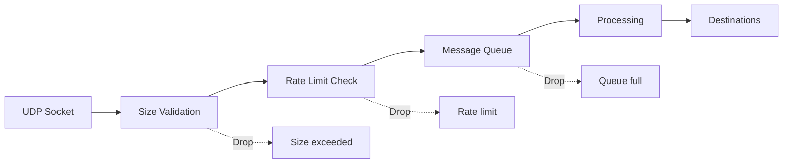

# UDP Queue Metrics

::: tip New in v13.1
UDP queue metrics were introduced in Butler SOS v13.1.
:::

Butler SOS uses internal message queues to handle incoming UDP messages from Qlik Sense. These queues provide protection against message flooding, enable backpressure detection, and ensure stable message processing under high load conditions.

## Why Monitor UDP Queues?

Qlik Sense Enterprise on Windows (QSEoW) sends continuous streams of UDP messages containing log events and user activity information. During high-usage periods or when Sense experiences issues, message rates can spike significantly.

Without proper queue management, message flooding could:

- Overwhelm Butler SOS and cause instability
- Create backpressure on downstream systems (InfluxDB, MQTT)
- Result in lost or dropped messages without visibility

UDP queue metrics provide visibility into:

- **Queue health** - Is the queue keeping up with incoming messages?
- **Backpressure detection** - Warnings when queue utilization exceeds thresholds
- **Dropped messages** - How many messages are being lost and why?
- **Processing performance** - How long does it take to process messages?

## Architecture

The message flow through Butler SOS queues:



Butler SOS maintains two separate queues:

1. **User Events Queue** - Handles session start/stop and connection open/close events
2. **Log Events Queue** - Handles log messages from Qlik Sense services

Each queue has its own configuration and metrics, allowing independent tuning based on message volume and importance.

## Key Metrics

### Queue Utilization

The `queue_utilization_pct` field shows what percentage of queue capacity is currently in use. High utilization (>80%) triggers backpressure warnings and may indicate:

- Message rate exceeds processing capacity
- Downstream systems (InfluxDB, MQTT) are slow to respond
- Configuration needs tuning

### Dropped Messages

Messages can be dropped for three reasons:

| Reason        | Field                         | Cause                                 |
| ------------- | ----------------------------- | ------------------------------------- |
| Rate limit    | `messages_dropped_rate_limit` | Message rate exceeds configured limit |
| Queue full    | `messages_dropped_queue_full` | Queue reached maximum capacity        |
| Size exceeded | `messages_dropped_size`       | Message larger than max UDP size      |

### Processing Time

Processing time metrics help identify performance issues:

- `processing_time_avg_ms` - Average time to process a message
- `processing_time_p95_ms` - 95th percentile (most messages complete within this time)
- `processing_time_max_ms` - Slowest message processing time

High processing times may indicate issues with downstream systems or network latency.

## Enabling Queue Metrics

Queue metrics storage to InfluxDB is disabled by default. To enable:

```yaml
Butler-SOS:
  userEvents:
    udpServerConfig:
      queueMetrics:
        influxdb:
          enable: true
          writeFrequency: 20000 # Write every 20 seconds
          measurementName: user_events_queue
          tags:
            - name: env
              value: prod

  logEvents:
    udpServerConfig:
      queueMetrics:
        influxdb:
          enable: true
          writeFrequency: 20000
          measurementName: log_events_queue
          tags: []
```

See the [User Events](/docs/getting-started/setup/qlik-sense-events/user-events) and [Log Events](/docs/getting-started/setup/qlik-sense-events/log-events) setup guides for complete configuration details.

## Troubleshooting

### Backpressure Warnings

**Symptom**: Log messages like:

```text
WARN: [UDP Queue] Backpressure detected for user_events: Queue utilization 85.5% (threshold: 80%)
```

**Causes**:

- Message rate exceeds processing capacity
- Downstream systems (InfluxDB/MQTT) slow to respond
- Insufficient `maxConcurrent` setting

**Solutions**:

1. Monitor queue metrics to identify patterns
2. Increase `maxConcurrent` if CPU/memory available
3. Increase `maxSize` for more buffer capacity
4. Check downstream system performance
5. Enable rate limiting if messages coming too fast

### Messages Being Dropped

**Symptom**: `messages_dropped_*` counters increasing in InfluxDB

**Dropped due to queue full** (`messages_dropped_queue_full`):

- Queue size too small for message bursts
- Increase `maxSize` configuration
- Increase `maxConcurrent` for faster processing

**Dropped due to rate limit** (`messages_dropped_rate_limit`):

- Rate limit too restrictive
- Increase `maxMessagesPerMinute`
- Disable rate limiting if appropriate
- Investigate why Sense is sending excessive messages

**Dropped due to size** (`messages_dropped_size`):

- Messages exceed UDP datagram size limit
- Usually indicates malformed messages from Sense
- Check Sense log appender configuration

### High Processing Times

**Symptom**: `processing_time_p95_ms` consistently > 1000ms

**Causes**:

- Downstream systems slow (InfluxDB write latency, MQTT broker delays)
- Network latency
- Too many concurrent operations causing resource contention

**Solutions**:

1. Check InfluxDB query performance and write latency
2. Check MQTT broker responsiveness
3. Reduce `maxConcurrent` to decrease resource contention
4. Review network latency between Butler SOS and destinations

### No Queue Metrics in InfluxDB

**Symptom**: Queue metrics not appearing in InfluxDB

**Checklist**:

1. Is `queueMetrics.influxdb.enable` set to `true` in config?
2. Is `Butler-SOS.influxdbConfig.enable` set to `true`?
3. Is InfluxDB connection working? (check logs for errors)
4. Is the correct measurement name configured?
5. Wait for `writeFrequency` interval to elapse (default 20 seconds)

### Debug Logging

Enable verbose logging to troubleshoot queue issues:

```yaml
Butler-SOS:
  logLevel: verbose # or 'debug' for more detail
```

Look for log messages with these prefixes:

- `[UDP Queue]` - Queue operations and status
- `UDP QUEUE METRICS INFLUXDB` - Metrics storage operations
- `USER EVENT QUEUE METRICS` / `LOG EVENT QUEUE METRICS` - Per-queue status

## Related Documentation

- [InfluxDB Metrics Reference](/docs/reference/available-metrics/influxdb#udp-queue-metrics) - Complete field and tag reference
- [User Events Setup](/docs/getting-started/setup/qlik-sense-events/user-events) - User events queue configuration
- [Log Events Setup](/docs/getting-started/setup/qlik-sense-events/log-events) - Log events queue configuration
- [Grafana UDP Queue Monitoring](/docs/examples/grafana/udp-queue-monitoring) - Example Grafana queries
