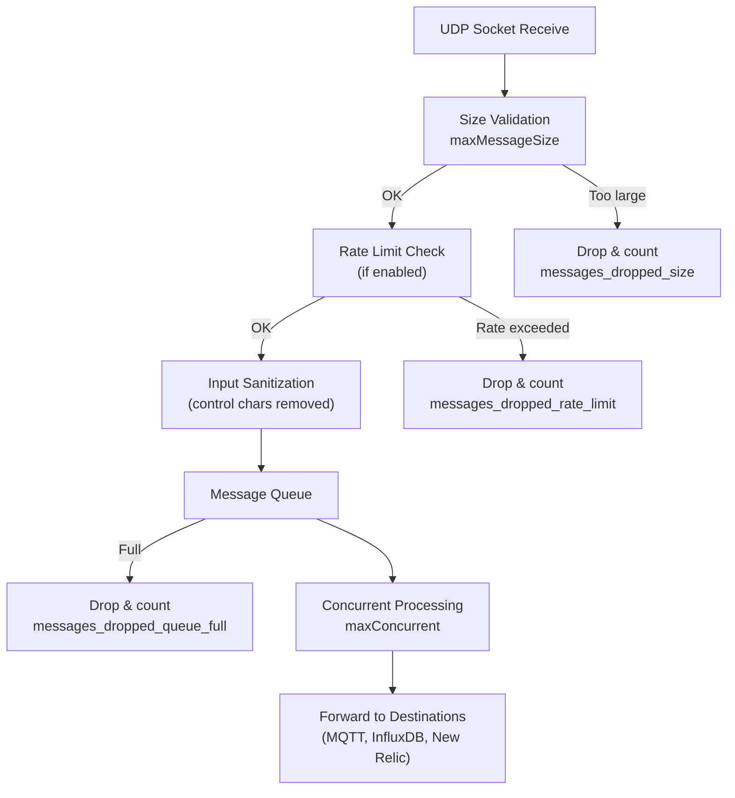

# UDP Message Queue

Butler SOS uses managed queues to handle incoming UDP messages from Qlik Sense. This ensures that a sudden burst of events doesn't overwhelm Butler SOS or its event destination.

## Overview

Both the **User Events** and **Log Events** UDP servers use message queues with the following protections:

- **Controlled concurrency** — messages are processed with a configurable limit on parallel operations
- **Optional rate limiting** — prevent message flooding by limiting messages per minute
- **Message size validation** — messages exceeding the maximum UDP datagram size are rejected
- **Backpressure detection** — warnings when queue utilization exceeds a configurable threshold
- **Queue metrics** — optional storage of queue health data in InfluxDB for monitoring and alerting

All messages flow through the queue — it cannot be disabled.

## Message Flow



### Components

- **Circular Buffer** — tracks last 1000 processing times for percentile calculations
- **Rate Limiter** — fixed-window counter that resets each minute
- **Metrics Collector** — thread-safe counters and timing data
- **InfluxDB Writer** — periodic metrics storage at configurable interval

## Configuration

### User Events Queue

```yaml
Butler-SOS:
  userEvents:
    udpServerConfig:
      serverHost: <IP or FQDN> # Host/IP where user event server will listen for events from Sense
      portUserActivityEvents: 9997 # Port on which user event server will listen for events from Sense
      # Message queue settings for handling incoming UDP messages
      messageQueue:
        maxConcurrent: 10 # Max number of messages being processed simultaneously (default: 10)
        maxSize: 200 # Max queue size before messages are dropped (default: 200)
        backpressureThreshold: 80 # Warn when queue utilization reaches this % (default: 80)
      # Rate limiting to prevent message flooding
      rateLimit:
        enable: false # Enable rate limiting (default: false)
        maxMessagesPerMinute: 600 # Max messages per minute, ~10/sec (default: 600)
      maxMessageSize: 65507 # Max UDP message size in bytes (default: 65507, UDP max)
      # Queue metrics storage in InfluxDB
      queueMetrics:
        influxdb:
          enable: false # Store queue metrics in InfluxDB (default: false)
          writeFrequency: 20000 # How often to write metrics, milliseconds (default: 20000)
          measurementName: user_events_queue # InfluxDB measurement name (default: user_events_queue)
          tags: # Optional tags added to queue metrics
            - name: qs_environment
              value: prod
```

### Log Events Queue

```yaml
Butler-SOS:
  logEvents:
    udpServerConfig:
      serverHost: <IP or FQDN> # Host/IP where log event server will listen for events from Sense
      portLogEvents: 9996 # Port on which log event server will listen for events from Sense
      # Message queue settings for handling incoming UDP messages
      messageQueue:
        maxConcurrent: 10 # Max number of messages being processed simultaneously (default: 10)
        maxSize: 200 # Max queue size before messages are dropped (default: 200)
        backpressureThreshold: 80 # Warn when queue utilization reaches this % (default: 80)
      # Rate limiting to prevent message flooding
      rateLimit:
        enable: false # Enable rate limiting (default: false)
        maxMessagesPerMinute: 600 # Max messages per minute (default: 600)
      maxMessageSize: 65507 # Max UDP message size in bytes (default: 65507, UDP max)
      # Queue metrics storage in InfluxDB
      queueMetrics:
        influxdb:
          enable: false # Store queue metrics in InfluxDB (default: false)
          writeFrequency: 20000 # How often to write metrics, milliseconds (default: 20000)
          measurementName: log_events_queue # InfluxDB measurement name (default: log_events_queue)
          tags: # Optional tags added to queue metrics
            - name: qs_environment
              value: prod
```

### Configuration Properties

#### messageQueue

| Property | Default | Description |
|----------|---------|-------------|
| `maxConcurrent` | 10 | Number of messages processed simultaneously. Higher values = more throughput but more CPU/memory usage. Recommended: 5-20 depending on server capacity. |
| `maxSize` | 200 | Maximum queue size. When exceeded, new messages are rejected and dropped. Recommended: 100-500. Note that the queue only counts pending messages (not those currently processing), so total capacity is `maxSize + maxConcurrent`. |
| `backpressureThreshold` | 80 | Queue utilization percentage that triggers backpressure warnings. Recommended: 70-90%. |

#### rateLimit

| Property | Default | Description |
|----------|---------|-------------|
| `enable` | false | Enable rate limiting to prevent message flooding. Rate limiting uses a fixed-window counter that resets each minute. |
| `maxMessagesPerMinute` | 600 | Maximum messages allowed per minute, across all source IPs. |

#### maxMessageSize

| Property | Default | Description |
|----------|---------|-------------|
| `maxMessageSize` | 65507 | Maximum UDP message size in bytes. The default is the UDP maximum datagram size. Messages exceeding this are rejected and counted in `messages_dropped_size`. |

#### queueMetrics.influxdb

| Property | Default | Description |
|----------|---------|-------------|
| `enable` | false | Store queue metrics in InfluxDB for monitoring and alerting. |
| `writeFrequency` | 20000 | How often to write metrics in milliseconds. Lower values = more frequent updates but more InfluxDB writes. |
| `measurementName` | varies | InfluxDB measurement name. Defaults: `user_events_queue` or `log_events_queue`. |
| `tags` | [] | Optional static tags added to all queue metrics data points in InfluxDB. |

## Performance Tuning

### Small Environment (< 50 users, < 10 apps)

```yaml
messageQueue:
  maxConcurrent: 5
  maxSize: 100
rateLimit:
  enable: false
```

### Medium Environment (50-200 users, 10-50 apps)

```yaml
messageQueue:
  maxConcurrent: 10
  maxSize: 200
rateLimit:
  enable: false
  maxMessagesPerMinute: 600
```

### Large Environment (200+ users, 50+ apps)

```yaml
messageQueue:
  maxConcurrent: 20
  maxSize: 500
rateLimit:
  enable: true
  maxMessagesPerMinute: 1200
```

### Tuning Based on Metrics

| Symptom | Likely Cause | Action |
|---------|-------------|--------|
| High queue utilization (> 80%) | Messages arriving faster than they can be processed | Increase `maxConcurrent` and/or `maxSize`. Check if downstream systems (InfluxDB, MQTT) are a bottleneck. |
| Dropped messages (`messages_dropped_queue_full` > 0) | Queue capacity insufficient for message bursts | Increase `maxSize` and/or `maxConcurrent`. Consider rate limiting at the Qlik Sense side. |
| High processing times (p95 > 1000ms) | Resource contention or slow downstream systems | Decrease `maxConcurrent` to reduce contention. Check downstream system performance and network latency. |
| Rate limit violations (`messages_dropped_rate_limit` > 0) | Rate limit too restrictive or excessive Sense messages | Increase `maxMessagesPerMinute` if capacity allows. Investigate why Sense is sending excessive messages. |

### Resource Considerations

**Memory usage:** Each queued message uses approximately 1-5 KB. At `maxSize: 200`, each queue uses about 200-1000 KB. Two queues (user + log events) use 400-2000 KB total.

**CPU usage:** Higher `maxConcurrent` values utilize more CPU cores. It is recommended to set `maxConcurrent` to at most the number of available CPU cores.

**InfluxDB load:** Each queue writes metrics at the configured `writeFrequency` interval. At the default 20 seconds, each queue writes 3 times per minute (6 writes/minute total). Increase the interval if InfluxDB is under load.

## Queue Metrics in InfluxDB

When `queueMetrics.influxdb.enable` is set to `true`, queue metrics are stored in InfluxDB as two separate measurements:

- `user_events_queue` (configurable measurement name for user events)
- `log_events_queue` (configurable measurement name for log events)

### Tags

| Tag | Type | Description |
|-----|------|-------------|
| `queue_type` | string | Queue identifier — `user_events` or `log_events` |
| `host` | string | Butler SOS hostname |
| Custom tags | string | From config `tags` array |

### Fields

#### Queue Status

| Field | Type | Description |
|-------|------|-------------|
| `queue_size` | integer | Current number of messages in queue |
| `queue_max_size` | integer | Maximum queue capacity |
| `queue_utilization_pct` | float | Queue utilization percentage (0-100) |
| `queue_running` | integer | Messages currently being processed |

#### Message Counters

| Field | Type | Description |
|-------|------|-------------|
| `messages_received` | integer | Total messages received (since last write) |
| `messages_queued` | integer | Messages added to queue |
| `messages_processed` | integer | Messages successfully processed |
| `messages_failed` | integer | Messages that failed processing |

#### Dropped Messages

| Field | Type | Description |
|-------|------|-------------|
| `messages_dropped_total` | integer | Total dropped messages |
| `messages_dropped_rate_limit` | integer | Dropped due to rate limit |
| `messages_dropped_queue_full` | integer | Dropped due to full queue |
| `messages_dropped_size` | integer | Dropped due to size validation |

#### Performance

| Field | Type | Description |
|-------|------|-------------|
| `processing_time_avg_ms` | float | Average processing time (milliseconds) |
| `processing_time_p95_ms` | float | 95th percentile processing time |
| `processing_time_max_ms` | float | Maximum processing time |

#### Rate Limit & Backpressure

| Field | Type | Description |
|-------|------|-------------|
| `rate_limit_current` | integer | Current message rate (messages/minute) |
| `backpressure_active` | integer | Backpressure status (0=inactive, 1=active) |

### Example Grafana Queries

**Queue utilization over time:**

```text
from(bucket: "butler-sos")
  |> range(start: -1h)
  |> filter(fn: (r) => r["_measurement"] == "user_events_queue" or r["_measurement"] == "log_events_queue")
  |> filter(fn: (r) => r["_field"] == "queue_utilization_pct")
```

**Messages dropped by reason:**

```text
from(bucket: "butler-sos")
  |> range(start: -1h)
  |> filter(fn: (r) => r["_measurement"] == "user_events_queue")
  |> filter(fn: (r) => r["_field"] =~ /messages_dropped_/)
  |> aggregateWindow(every: 1m, fn: sum)
```

**Processing time percentiles:**

```text
from(bucket: "butler-sos")
  |> range(start: -1h)
  |> filter(fn: (r) => r["_measurement"] == "log_events_queue")
  |> filter(fn: (r) => r["_field"] == "processing_time_p95_ms" or r["_field"] == "processing_time_avg_ms")
```

**Backpressure events:**

```text
from(bucket: "butler-sos")
  |> range(start: -24h)
  |> filter(fn: (r) => r["_field"] == "backpressure_active")
  |> filter(fn: (r) => r["_value"] == 1)
```

## Troubleshooting

### Backpressure Warnings

**Symptom:** Log messages like:
```
WARN: [UDP Queue] Backpressure detected for user_events: Queue utilization 85.5% (threshold: 80%)
```

**Causes:**
- Message rate exceeds processing capacity
- Downstream systems (InfluxDB/MQTT) are slow to respond
- Insufficient `maxConcurrent` setting

**Solutions:**
1. Monitor queue metrics to identify the pattern
2. Increase `maxConcurrent` if CPU/memory is available
3. Increase `maxSize` for more buffer capacity
4. Check downstream system performance
5. Enable rate limiting if messages are arriving too fast

### Messages Being Dropped

**Queue full drops (`messages_dropped_queue_full`):**
- Queue size too small for message bursts
- Increase `maxSize` and/or `maxConcurrent`

**Rate limit drops (`messages_dropped_rate_limit`):**
- Rate limit too restrictive
- Increase `maxMessagesPerMinute` or disable rate limiting
- Investigate why Send is sending so many messages

**Size validation drops (`messages_dropped_size`):**
- Messages exceed the UDP datagram size
- Usually indicates malformed messages from Qlik Sense
- Check your Qlik Sense log appender configuration

### High Processing Times

**Symptom:** `processing_time_p95_ms` > 1000ms

**Causes:** Downstream systems slow (InfluxDB write latency, MQTT broker delays), network latency, too many concurrent operations causing resource contention.

**Solutions:**
1. Check InfluxDB query performance
2. Check MQTT broker responsiveness
3. Reduce `maxConcurrent` to decrease resource contention
4. Review network latency between Butler SOS and destinations

### Debug Logging

For verbose queue debugging, set the Butler SOS log level to `verbose` or `debug`:

```yaml
Butler-SOS:
  logLevel: verbose
```

Look for log messages with these prefixes:
- `[UDP Queue]` — Queue operations and status
- `UDP QUEUE METRICS INFLUXDB` — Metrics storage operations
- `USER EVENT QUEUE METRICS` / `LOG EVENT QUEUE METRICS` — Per-queue status

### No Queue Metrics in InfluxDB

If queue metrics are not appearing in InfluxDB, check:
1. `queueMetrics.influxdb.enable` is set to `true`
2. `Butler-SOS.influxdbConfig.enable` is set to `true`
3. The InfluxDB connection is working (check Butler SOS logs)
4. The configured measurement name is correct
5. Wait for the `writeFrequency` interval to elapse

### Config Validation Errors

**Symptom:** Butler SOS fails to start with config validation errors.

**Cause:** The config file is missing required queue configuration sections under `udpServerConfig`.

**Solution:** Major Butler SOS releases can introduce breaking changes to the config file structure. See the [warning above](#configuration) for upgrade instructions — back up your config, use `production_template.yaml` from the release ZIP as a fresh base, then re-apply your custom settings.

## Monitoring Best Practices

### Essential Alerts

| Condition | Suggested Threshold |
|-----------|-------------------|
| Queue utilization too high | `queue_utilization_pct > 90` for >5 minutes |
| Excessive dropped messages | `messages_dropped_total > 100` per minute |
| Persistent backpressure | `backpressure_active = 1` for >10 minutes |
| Processing degradation | `processing_time_p95_ms > 2000` |

### Recommended Dashboard Panels

1. Queue utilization percentage (line chart, both queues)
2. Messages received vs processed (line chart)
3. Dropped messages by reason (stacked area chart)
4. Processing time percentiles (line chart: avg, p95, max)
5. Backpressure status (state timeline)
6. Current queue size (gauge)

### Proactive Monitoring

- Establish baseline processing times for your environment during normal operations
- Review queue metrics weekly to catch trends before they become problems
- Test queue behavior during peak usage periods (e.g., end-of-month reloads)
- Adjust thresholds after observing actual patterns rather than relying solely on defaults
