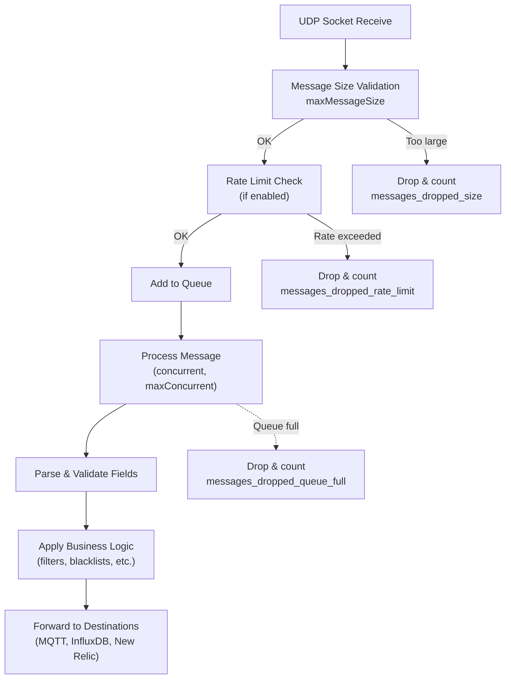

# UDP Payload Format Reference

Butler SOS receives real-time events from Qlik Sense Enterprise on Windows (QSEoW) via two UDP endpoints:

- **User Events** — default port 9997
- **Log Events** — default port 9996

This reference describes the message formats for both endpoints.

---

## User Events UDP Payload

User events capture session start/stop and connection open/close activity from Qlik Sense proxies.

**Accepted message types:** `/qseow-proxy-connection/`, `/qseow-proxy-session/`

### Message Format

UDP messages are semicolon-separated text strings with 8 fields:

```text
message_type;host;command;user_directory;user_id;origin;context;message
```

### Field Specification

| Field | Name | Max Length | Description |
|-------|------|-----------|-------------|
| 1 | Message Type | 100 | `/qseow-proxy-connection/` or `/qseow-proxy-session/` |
| 2 | Host | 100 | Hostname where the event occurred |
| 3 | Command | 100 | `Start session`, `Stop session`, `Open connection`, `Close connection` |
| 4 | User Directory | 100 | QSEoW user directory (e.g. `LAB`) |
| 5 | User ID | 100 | QSEoW user ID (e.g. `goran`) |
| 6 | Origin | 200 | Origin of the event |
| 7 | Context | 500 | Context where the event occurred. May contain `/app/<guid>` for app ID extraction |
| 8 | Message | 1000 | Event message. May contain semicolons and single quotes. May include UserAgent information |

### Special Processing

- **Field 8 (Message)**: The first 7 fields are split by `;`, then field 8 is extracted from the remaining content after the 7th semicolon. This preserves semicolons within the message field.
- **App ID extraction**: If the context field starts with `/app/<guid>`, the app ID is extracted.
- **App name lookup**: If an app ID is found, Butler SOS looks up the app name from its internal app list. If not found, the app name is set to `<unknown app name>`.
- **User agent parsing**: If the message contains `UserAgent:`, the user agent string is parsed into structured fields (browser name, browser version, OS name, OS version).
- **User full name**: A combined field `user_full` is created as `<user_directory>\<user_id>` (e.g. `LAB\goran`).
- **User blacklist**: Users matching `Butler-SOS.userEvents.excludeUser` (directory + userId) are skipped.

### Example Payloads

```text
/qseow-proxy-session/;server1.domain.com;Start session;LAB;goran;https://sense.domain.com;app/e7af59a0-c243-480d-9571-08727551a66f;UserAgent: 'Mozilla/5.0 (Windows NT 10.0; Win64; x64) AppleWebKit/537.36'
```

```text
/qseow-proxy-connection/;server2.domain.com;Open connection;LAB;jdoe;https://sense.domain.com;hub;Connection established
```

---

## Log Events UDP Payload

Butler SOS supports 5 types of log events from QSEoW services. Each type has a different payload structure.

### Common Validations

- **Source validation**: Only process messages of types that match the enabled sources in the config file.
- **Date validation**: ISO 8601 timestamps are validated. Invalid dates are set to empty string.
- **UUID validation**: UUID fields are validated. Invalid UUIDs are set to empty string.
- **Field sanitization**: All string fields have control characters removed and are truncated to their maximum length.

---

### Engine Events (`/qseow-engine/`)

Engine events capture warnings, errors, and fatals from the Qlik Sense engine service. There are 19 fields.

| # | Name | Max Length | Validation | Description |
|---|------|-----------|------------|-------------|
| 1 | source | 100 | - | Always `/qseow-engine/` |
| 2 | log_row | - | Must be integer > 0 | Row number in log |
| 3 | ts_iso | 50 | ISO 8601 | Timestamp in compact format: `20211109T153726.028+0200` |
| 4 | ts_local | 50 | Local timestamp | Timestamp in local format: `2021-11-09 15:37:26,028` |
| 5 | level | 20 | - | `WARN`, `ERROR`, `FATAL` |
| 6 | host | 100 | - | Hostname |
| 7 | subsystem | 200 | - | QSEoW subsystem |
| 8 | windows_user | 100 | - | `DOMAIN\qlikservice` |
| 9 | message | 1000 | - | Log message (may contain `;` and `'`) |
| 10 | proxy_session_id | - | UUID | Proxy session ID |
| 11 | user_directory | 100 | - | QSEoW user directory |
| 12 | user_id | 100 | - | QSEoW user ID |
| 13 | engine_ts | 50 | - | Engine timestamp (ISO 8601) |
| 14 | process_id | - | UUID | Engine process ID |
| 15 | engine_exe_version | 50 | - | Engine version |
| 16 | server_started | 50 | - | Server start time (ISO 8601) |
| 17 | entry_type | 50 | - | Entry type |
| 18 | session_id | - | UUID | Session ID |
| 19 | app_id | - | UUID | App ID |

**Accepted date formats for engine events:**

| Format | Example |
|--------|---------|
| Compact ISO 8601 | `20211109T153726.028+0200` |
| Hyphenated ISO 8601 | `2021-11-09T15:37:26.028+0200` |
| Local timestamp | `2021-11-09 15:37:26,028` |

---

### Proxy Events (`/qseow-proxy/`)

Proxy events capture warnings, errors, and fatals from the Qlik Sense proxy service. There are 16 fields.

| # | Name | Max Length | Validation | Description |
|---|------|-----------|------------|-------------|
| 1 | source | 100 | - | Always `/qseow-proxy/` |
| 2 | log_row | - | Must be integer > 0 | Row number |
| 3 | ts_iso | 50 | ISO 8601 | ISO 8601 timestamp |
| 4 | ts_local | 50 | Local timestamp | Local timestamp |
| 5 | level | 20 | - | `WARN`, `ERROR`, `FATAL` |
| 6 | host | 100 | - | Hostname |
| 7 | subsystem | 200 | - | QSEoW subsystem |
| 8 | windows_user | 100 | - | `DOMAIN\qlikservice` |
| 9 | message | 1000 | - | Log message |
| 10 | exception_message | 1000 | - | Exception message (empty if none) |
| 11 | user_directory | 100 | - | QSEoW user directory |
| 12 | user_id | 100 | - | QSEoW user ID |
| 13 | command | 200 | - | Command carried out |
| 14 | result_code | 50 | - | Result code |
| 15 | origin | 200 | - | Origin of log event |
| 16 | context | 200 | - | Context where event occurred |

---

### Repository Events (`/qseow-repository/`)

Repository events capture warnings, errors, and fatals from the Qlik Sense repository service. The field structure is identical to Proxy Events (16 fields).

---

### Scheduler Events (`/qseow-scheduler/`)

Scheduler events capture warnings, errors, and fatals from the Qlik Sense scheduler service. There are 18 fields.

| # | Name | Max Length | Validation | Description |
|---|------|-----------|------------|-------------|
| 1 | source | 100 | - | Always `/qseow-scheduler/` |
| 2 | log_row | - | Must be integer > 0 | Row number |
| 3 | ts_iso | 50 | ISO 8601 | ISO 8601 timestamp |
| 4 | ts_local | 50 | Local timestamp | Local timestamp |
| 5 | level | 20 | - | `WARN`, `ERROR`, `FATAL` |
| 6 | host | 100 | - | Hostname |
| 7 | subsystem | 200 | - | QSEoW subsystem |
| 8 | windows_user | 100 | - | `DOMAIN\qlikservice` |
| 9 | message | 1000 | - | Log message |
| 10 | exception_message | 1000 | - | Exception message |
| 11 | user_directory | 100 | - | QSEoW user directory |
| 12 | user_id | 100 | - | QSEoW user ID |
| 13 | user_full | 200 | - | `DOMAIN\user` format |
| 14 | task_name | 200 | - | Task name |
| 15 | app_name | 200 | - | App name |
| 16 | task_id | - | UUID | Task ID |
| 17 | app_id | - | UUID | App ID |
| 18 | execution_id | - | UUID | Execution ID |

---

### QIX Performance Events (`/qseow-qix-perf/`)

QIX performance events capture detailed engine performance data including method execution times, memory usage, and object-level metrics. Requires `Butler-SOS.logEvents.enginePerformanceMonitor.enable: true`. There are 26 fields.

| # | Name | Max Length | Validation | Description |
|---|------|-----------|------------|-------------|
| 1 | source | 100 | - | Always `/qseow-qix-perf/` |
| 2 | log_row | - | Must be integer > 0 | Row number |
| 3 | ts_iso | 50 | - | ISO 8601 timestamp |
| 4 | ts_local | 50 | - | Local timestamp |
| 5 | level | 20 | - | `WARN`, `ERROR`, `FATAL` |
| 6 | host | 100 | - | Hostname |
| 7 | subsystem | 200 | - | QSEoW subsystem |
| 8 | windows_user | 100 | - | `DOMAIN\qlikservice` |
| 9 | proxy_session_id | - | UUID | Proxy session ID. If `0`, denotes non-user activity (e.g. scheduled reload) |
| 10 | user_directory | 100 | - | QSEoW user directory |
| 11 | user_id | 100 | - | QSEoW user ID |
| 12 | engine_ts | 50 | - | Engine timestamp |
| 13 | session_id | - | UUID | Session ID |
| 14 | app_id | - | UUID | Document/app ID |
| 15 | request_id | - | Must be integer >= 0 | Request ID |
| 16 | method | 100 | - | e.g. `Global::OpenApp`, `Doc::GetAppLayout` |
| 17 | process_time | - | Float | Milliseconds |
| 18 | work_time | - | Float | Milliseconds |
| 19 | lock_time | - | Float | Milliseconds |
| 20 | validate_time | - | Float | Milliseconds |
| 21 | traverse_time | - | Float | Milliseconds |
| 22 | handle | - | Must be integer >= 0 | Handle (-1 or number) |
| 23 | object_id | 100 | - | UUID or short identifier like `rwPjBk` |
| 24 | net_ram | - | Must be integer >= 0 | Bytes |
| 25 | peak_ram | - | Must be integer >= 0 | Bytes |
| 26 | object_type | 100 | - | e.g. `AppPropsList`, `linechart`, `barchart` |

#### Special Processing

**Event activity source:** Determined by `proxy_session_id`. If `0`, the activity is classified as non-user (e.g. scheduled reload). Otherwise it is classified as user activity.

**App name lookup:** If `Butler-SOS.logEvents.enginePerformanceMonitor.appNameLookup.enable` is true, Butler SOS looks up the app name from its internal app list using the `app_id`.

**Filtering:** Two levels of filters in `Butler-SOS.logEvents.enginePerformanceMonitor.monitorFilter`:
- `appSpecific` — filter by app ID, app name, object, method
- `allApps` — filter across all apps

Events that do not match any filter are skipped (and can be tracked via the rejected events counter if `trackRejectedEvents.enable` is true).

---

## Message Processing and Validation

### Processing Flow



### Validations

**Message size validation:** Controlled by `maxMessageSize` (default: 65507 bytes, the UDP maximum). Messages exceeding this limit are dropped and counted in `messages_dropped_size`.

**Rate limiting (optional):** Controlled by `rateLimit.enable` (default: false) and `rateLimit.maxMessagesPerMinute` (default: 600). Uses a fixed 1-minute window. Messages exceeding the rate are dropped and counted in `messages_dropped_rate_limit`.

**Queue management:** Controlled by `messageQueue.maxConcurrent` (default: 10), `messageQueue.maxSize` (default: 200), and `messageQueue.backpressureThreshold` (default: 80%). When the queue is full, messages are dropped and counted in `messages_dropped_queue_full`.

**Source/type validation:** User events only accept `/qseow-proxy-connection/` and `/qseow-proxy-session/`. Log events must match the enabled sources in the config file (`Butler-SOS.logEvents.source.<type>.enable`).

**Field sanitization:** All string fields have control characters (ASCII 0x00-0x1F, 0x7F) removed and are truncated to their specified maximum length.

---

## Configuration Reference

### UDP Server Configuration

```yaml
Butler-SOS:
  userEvents:
    enable: true
    udpServerConfig:
      serverHost: '<IP or FQDN>'
      portUserActivityEvents: 9997
      enableSourceValidation: false
      allowedSources: []
      messageQueue:
        maxConcurrent: 10
        maxSize: 200
        backpressureThreshold: 80
      rateLimit:
        enable: false
        maxMessagesPerMinute: 600
      maxMessageSize: 65507
      queueMetrics:
        influxdb:
          enable: false
          writeFrequency: 20000
          measurementName: user_events_queue
          tags: []

  logEvents:
    udpServerConfig:
      serverHost: '<IP or FQDN>'
      portLogEvents: 9996
      enableSourceValidation: false
      allowedSources: []
      messageQueue:
        maxConcurrent: 10
        maxSize: 200
        backpressureThreshold: 80
      rateLimit:
        enable: false
        maxMessagesPerMinute: 600
      maxMessageSize: 65507
      queueMetrics:
        influxdb:
          enable: false
          writeFrequency: 20000
          measurementName: log_events_queue
          tags: []
    source:
      engine:
        enable: false
      proxy:
        enable: false
      repository:
        enable: false
      scheduler:
        enable: false
      qixPerf:
        enable: true
        enginePerformanceMonitor:
          enable: true
          appNameLookup:
            enable: true
          monitorFilter:
            appSpecific: []
            allApps: []
          trackRejectedEvents:
            enable: false
```

### Log Event Source Enables

Each log source must be explicitly enabled in the config file:

```yaml
Butler-SOS:
  logEvents:
    source:
      engine:   enable: true   # Process /qseow-engine/ messages
      proxy:    enable: true   # Process /qseow-proxy/ messages
      repository: enable: true # Process /qseow-repository/ messages
      scheduler: enable: true  # Process /qseow-scheduler/ messages
      qixPerf:  enable: true   # Process /qseow-qix-perf/ messages
```

---

## Important Notes

1. **UDP is connectionless**: No delivery guarantees. Messages may be lost, duplicated, or arrive out of order.

2. **Message size limit**: Default is 65507 bytes (UDP maximum). Can be reduced via `maxMessageSize`.

3. **Semicolons in fields**: User event field 8 (message) and log event field 9 (message) may contain semicolons. Butler SOS uses special handling to preserve these.

4. **Queue is always on**: All messages flow through managed queues with controlled concurrency. The queue cannot be disabled.

5. **Rate limiting is optional**: Disabled by default. Enable if experiencing message flooding.

6. **UUID validation**: Invalid UUIDs are set to empty string, allowing partial processing of otherwise malformed messages.

7. **Date validation**: Invalid dates are set to empty string. Both compact and hyphenated ISO 8601 formats are accepted for engine events.

8. **App ID in context**: User events can extract app ID from the context field if it matches the `/app/<guid>` pattern.

9. **Single quotes in fields**: Message fields may contain single quotes, which are handled during processing.
